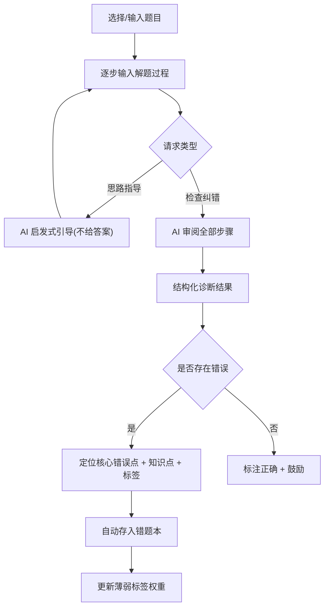
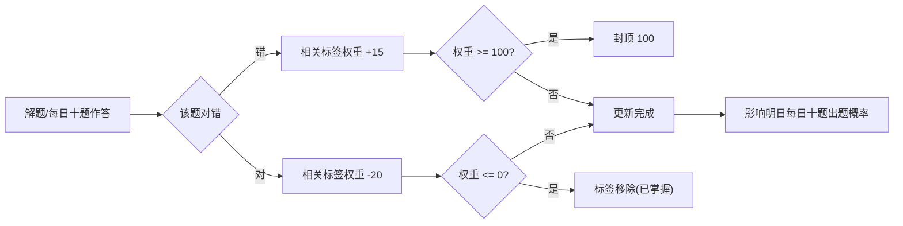

# 产品需求文档 (PRD) - AI 理科教师

## 1. 产品概述

一款面向初中学生的数学 AI 辅导应用。不同于传统"给题给答案"的工具，本产品扮演**理科教师**角色：通过审阅学生的解题步骤进行过程式诊断——卡壳时启发思路、计算出错时精准定位、逻辑跳跃时指出跳步、毫无思路时构建思维路径。每次诊断输出核心错误点、精炼课本知识点与薄弱标签，自动存入错题本，并驱动自适应"每日十题"巩固薄弱环节。

- **目标用户**：初中（7-9 年级）学生
- **核心价值**：从"对答案"升级为"看过程、给指导、建画像、自适应"的个性化辅导
- **学科范围（首版）**：初中数学

## 2. 核心功能

### 2.1 用户角色

| 角色 | 说明 |
|------|------|
| 学生 | 核心用户，进行解题练习、查看诊断、使用错题本与每日十题 |

### 2.2 功能模块

1. **首页**：今日学习概览、每日十题入口、最近错题速览、薄弱标签提醒
2. **解题页**：题目录入 + 分步解题输入 + AI 实时诊断（核心功能）
3. **错题本**：错题列表、标签筛选、错题重做、标签权重展示
4. **每日十题**：基于薄弱标签权重的自适应出题与作答反馈
5. **画像页**：知识点掌握度可视化、薄弱标签雷达图、学习数据统计

### 2.3 页面详情

| 页面 | 模块 | 功能描述 |
|------|------|----------|
| 首页 | 今日概览卡 | 显示今日待完成每日十题、连续学习天数、本周错题数 |
| 首页 | 快捷入口 | 解题练习、每日十题、错题本三大入口 |
| 首页 | 薄弱标签提醒 | 展示当前权重最高的 3 个薄弱知识点，提示巩固 |
| 首页 | 最近错题 | 最近 3 道错题速览，可点击重做 |
| 解题页 | 题目区 | 展示题目内容（来自题库或手动输入） |
| 解题页 | 解题步骤区 | 学生逐步输入解题过程，支持随时请求"思路指导"或"检查纠错" |
| 解题页 | AI 诊断结果 | 诊断类型标签、核心错误点定位、思路指导（启发式不直接给答案）、课本知识点、薄弱标签 |
| 解题页 | 错题收录 | 诊断有误时一键存入错题本，附带标签与知识点 |
| 错题本 | 错题列表 | 按时间/标签筛选，展示题目、错误类型、标签、掌握度 |
| 错题本 | 标签筛选 | 按薄弱标签筛选错题，展示标签当前权重 |
| 错题本 | 错题重做 | 重新作答并触发标签权重更新 |
| 每日十题 | 出题区 | 自动生成 10 题，按薄弱标签权重加权抽样 |
| 每日十题 | 作答反馈 | 每题作答后即时反馈对错，全对/错误触发标签权重更新 |
| 每日十题 | 完成报告 | 完成后展示正确率、涉及知识点、权重变化 |
| 画像页 | 掌握度地图 | 按知识章节展示掌握程度（精通/熟悉/薄弱/未学） |
| 画像页 | 薄弱标签雷达 | 雷达图展示各薄弱方向权重 |
| 画像页 | 学习统计 | 累计解题数、错题数、连续打卡天数、进步趋势 |

## 3. 核心流程

### 3.1 解题诊断流程

学生选择或输入题目 → 逐步输入解题过程 → 在任意节点可发起两类请求：
- **"思路指导"**：当学生卡壳或无思路时，AI 以苏格拉底式启发给出方向，绝不直接给答案
- **"检查纠错"**：当学生认为做完时，AI 审阅全部步骤，定位错误

AI 返回结构化诊断：诊断类型（卡壳中途/计算错误/逻辑错误/跳步/完全无思路/正确）→ 核心错误点（精准到具体步骤）→ 指导思路 → 课本知识点 → 薄弱标签。若有误则自动收录错题本并更新标签权重。

### 3.2 标签权重自适应流程

薄弱标签权重区间 0-100，新标签创建时默认 50：
- **连续错误**：权重 +15（上限 100）
- **作答正确**：权重 -20（下限 0，归零后标签移除）

每日十题出题概率与标签权重正相关：权重越高，相关题目出现概率越大；权重归零后该标签题目不再优先出现，腾出位置给其他薄弱点。

### 3.3 每日十题流程

每日生成 10 题 → 按标签权重加权抽样（高权重标签优先出题，混入少量复习与新题）→ 逐题作答 → 即时反馈 → 全部完成后生成报告并更新标签权重。

## 4. 用户界面设计

### 4.1 设计风格

**设计概念："红笔批注"——数字数学练习本**

核心理念：模拟真实教师在练习本上用红笔批注的场景。AI 教师的指导以"红笔批注"形式呈现，既亲切又有权威感，契合"理科教师"定位。

- **主色（墨蓝）**：`#1E2A5E`——沉稳学术感，用于标题、主要文字、导航
- **批注红**：`#E63946`——教师红笔，用于错误标注、核心错误点、重要提醒
- **鼓励绿**：`#2A9D8F`——正确反馈、掌握度良好
- **纸本底色**：`#FAF7F0`——温暖米白，模拟练习本质感
- **按钮风格**：圆角胶囊型，主按钮墨蓝实底，次按钮描边
- **字体**：标题用衬线体（学术感），正文用无衬线体（清晰易读），公式用等宽体
- **布局**：移动端底部 Tab 导航，卡片式内容，解题步骤区模拟横线本
- **图标**：lucide-react 线性图标，简洁统一
- **动效**：批注红笔以"书写"动画呈现，诊断结果卡片错落淡入，错题收录有盖章动效

### 4.2 页面设计概览

| 页面 | 模块 | UI 要素 |
|------|------|---------|
| 首页 | 今日概览卡 | 墨蓝渐变卡片，白色大字数字，圆角 |
| 首页 | 快捷入口 | 三宫格图标按钮，hover 微浮起 |
| 首页 | 薄弱标签 | 红色标签胶囊，权重越高红色越深 |
| 解题页 | 题目区 | 顶部固定，纸本背景，衬线标题 |
| 解题页 | 步骤区 | 模拟横线本，每步带序号圆点 |
| 解题页 | 诊断结果 | 批注红书写动效，错误点红色下划波浪线 |
| 错题本 | 错题卡 | 白卡片，左侧红色色条标错误类型，右侧标签胶囊 |
| 每日十题 | 题目卡 | 居中大卡片，进度条显示 x/10 |
| 画像页 | 雷达图 | 墨蓝填充半透明，红色描边 |
| 画像页 | 掌握度地图 | 章节列表，彩色圆点表示掌握程度 |

### 4.3 响应式

- **移动端优先**：所有页面以 375px 宽度为基准设计，单列布局
- **触控优化**：按钮最小 44px 触控区，步骤输入区支持长按编辑
- **大屏适配**：在桌面端居中显示最大 480px 宽的应用容器，两侧留白
- **PWA**：可安装到手机桌面，全屏沉浸体验

## 5. 诊断类型定义

AI 诊断结果分为以下类型，每种对应不同的指导策略：

| 诊断类型 | 触发场景 | AI 指导策略 |
|----------|----------|-------------|
| 卡壳中途 | 学生做到一半请求思路 | 启发下一步方向，提示所用定理/方法，不给答案 |
| 计算错误 | 步骤中存在算术错误 | 精准指出哪一步算错，给出正确计算方向 |
| 逻辑错误 | 推理过程有逻辑缺陷 | 指出逻辑断裂点，引导重新推理 |
| 跳步 | 步骤间缺少必要过渡 | 指出跳过的关键步骤，要求补全 |
| 完全无思路 | 学生未动笔请求指导 | 从题目条件出发，构建分析框架与思路树 |
| 正确 | 解题完全正确 | 肯定并可选给出更优解法提示 |
