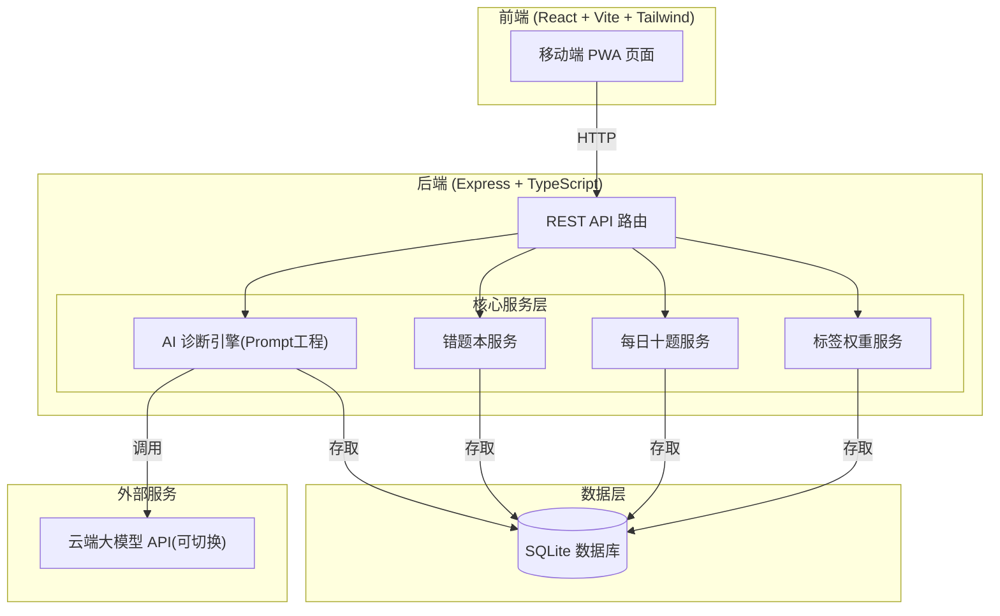
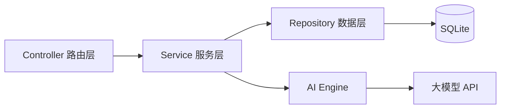
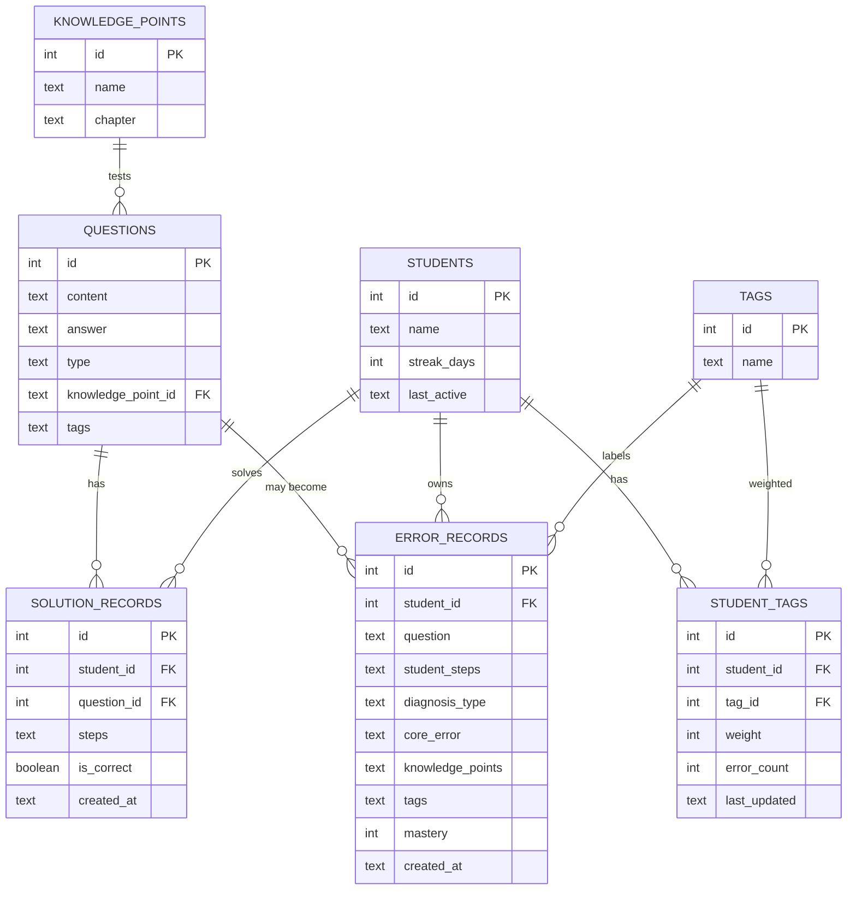

# 技术架构文档 - AI 理科教师

## 1. 架构设计



## 2. 技术说明

- **前端**：React@18 + TypeScript + Vite + Tailwind CSS + Zustand（状态管理）+ React Router
- **初始化工具**：vite-init（react-express-ts 模板）
- **后端**：Express@4 + TypeScript（ESM 格式）
- **数据库**：SQLite（轻量文件型，适合首版，后续可迁移）
- **AI 服务**：云端大模型 API，采用 OpenAI 兼容接口，支持切换不同厂商（OpenAI / 智谱 / 通义 / DeepSeek 等），通过环境变量配置
- **图表**：自研轻量 SVG 雷达图与进度组件（避免重型图表库）

## 3. 路由定义

| 路由 | 用途 |
|------|------|
| `/` | 首页 - 今日概览与快捷入口 |
| `/solve` | 解题页 - 题目录入与 AI 诊断（核心） |
| `/notebook` | 错题本 - 错题列表与标签筛选 |
| `/daily` | 每日十题 - 自适应练习 |
| `/profile` | 画像页 - 知识掌握度与薄弱标签 |

## 4. API 定义

### 4.1 AI 诊断接口

```typescript
// POST /api/analyze
interface AnalyzeRequest {
  question: string;          // 题目内容
  steps: string[];           // 学生解题步骤数组
  mode: 'guide' | 'check';   // guide=思路指导, check=检查纠错
}

interface AnalyzeResponse {
  diagnosisType: 'stuck' | 'calc_error' | 'logic_error' | 'skip_step' | 'no_idea' | 'correct';
  errorStep?: number;        // 出错步骤序号(从1开始)
  coreError: string;         // 核心错误点描述
  guidance: string;          // 指导思路(启发式,不给答案)
  knowledgePoints: string[]; // 关联课本知识点
  weakTags: string[];        // 薄弱标签
  isCorrect: boolean;        // 是否完全正确
}
```

### 4.2 错题本接口

```typescript
// GET /api/notebook?tag=xxx   获取错题列表(可按标签筛选)
// POST /api/notebook           新增错题
// DELETE /api/notebook/:id     删除错题

interface ErrorRecord {
  id: number;
  question: string;
  studentSteps: string[];
  diagnosisType: string;
  coreError: string;
  knowledgePoints: string[];
  tags: string[];
  createdAt: string;
  mastery: number;           // 掌握度 0-100
}
```

### 4.3 标签权重接口

```typescript
// GET /api/tags               获取所有标签及权重
// POST /api/tags/adjust       调整标签权重(内部调用)

interface Tag {
  name: string;
  weight: number;            // 0-100
  errorCount: number;        // 连错次数
  lastUpdated: string;
}
```

### 4.4 每日十题接口

```typescript
// GET /api/daily/generate     生成今日10题(加权抽样)
// POST /api/daily/submit      提交作答结果

interface DailyQuestion {
  id: number;
  question: string;
  options?: string[];        // 选择题选项(非选择题为空)
  answer: string;
  knowledgePoints: string[];
  tags: string[];
}

interface DailySubmit {
  results: { questionId: number; correct: boolean }[];
}
```

### 4.5 画像接口

```typescript
// GET /api/profile            获取学生画像数据

interface ProfileData {
  totalSolved: number;
  totalErrors: number;
  streakDays: number;
  masteryMap: { chapter: string; mastery: number }[];
  weakTags: { name: string; weight: number }[];
}
```

## 5. 服务端架构



- **Controller 层**：`api/routes/*.ts` 处理 HTTP 请求与响应
- **Service 层**：`api/services/*.ts` 业务逻辑（诊断、错题、标签、出题）
- **Repository 层**：`api/repository/*.ts` 数据库操作
- **AI Engine**：`api/services/ai-engine.ts` Prompt 工程与模型调用

## 6. 数据模型

### 6.1 ER 图



### 6.2 数据定义语言 (DDL)

```sql
-- 学生表
CREATE TABLE IF NOT EXISTS students (
  id INTEGER PRIMARY KEY AUTOINCREMENT,
  name TEXT NOT NULL DEFAULT '学生',
  streak_days INTEGER DEFAULT 0,
  last_active TEXT,
  created_at TEXT DEFAULT (datetime('now'))
);

-- 知识点表
CREATE TABLE IF NOT EXISTS knowledge_points (
  id INTEGER PRIMARY KEY AUTOINCREMENT,
  name TEXT NOT NULL,
  chapter TEXT NOT NULL,
  grade INTEGER NOT NULL
);

-- 题目库
CREATE TABLE IF NOT EXISTS questions (
  id INTEGER PRIMARY KEY AUTOINCREMENT,
  content TEXT NOT NULL,
  answer TEXT NOT NULL,
  type TEXT NOT NULL DEFAULT 'fill',  -- choice/fill/solve
  options TEXT,                        -- JSON 数组(选择题)
  knowledge_point_id INTEGER,
  tags TEXT,                           -- JSON 数组
  FOREIGN KEY (knowledge_point_id) REFERENCES knowledge_points(id)
);

-- 解题记录
CREATE TABLE IF NOT EXISTS solution_records (
  id INTEGER PRIMARY KEY AUTOINCREMENT,
  student_id INTEGER NOT NULL,
  question_id INTEGER,
  question_text TEXT NOT NULL,
  steps TEXT NOT NULL,                 -- JSON 数组
  is_correct INTEGER DEFAULT 0,
  created_at TEXT DEFAULT (datetime('now')),
  FOREIGN KEY (student_id) REFERENCES students(id)
);

-- 错题本
CREATE TABLE IF NOT EXISTS error_records (
  id INTEGER PRIMARY KEY AUTOINCREMENT,
  student_id INTEGER NOT NULL,
  question TEXT NOT NULL,
  student_steps TEXT NOT NULL,         -- JSON 数组
  diagnosis_type TEXT NOT NULL,
  core_error TEXT NOT NULL,
  guidance TEXT,
  knowledge_points TEXT,               -- JSON 数组
  tags TEXT,                           -- JSON 数组
  mastery INTEGER DEFAULT 50,
  created_at TEXT DEFAULT (datetime('now')),
  FOREIGN KEY (student_id) REFERENCES students(id)
);

-- 标签表
CREATE TABLE IF NOT EXISTS tags (
  id INTEGER PRIMARY KEY AUTOINCREMENT,
  name TEXT UNIQUE NOT NULL
);

-- 学生标签权重表
CREATE TABLE IF NOT EXISTS student_tags (
  id INTEGER PRIMARY KEY AUTOINCREMENT,
  student_id INTEGER NOT NULL,
  tag_id INTEGER NOT NULL,
  weight INTEGER DEFAULT 50,
  error_count INTEGER DEFAULT 1,
  last_updated TEXT DEFAULT (datetime('now')),
  FOREIGN KEY (student_id) REFERENCES students(id),
  FOREIGN KEY (tag_id) REFERENCES tags(id),
  UNIQUE(student_id, tag_id)
);

-- 索引
CREATE INDEX IF NOT EXISTS idx_error_tags ON error_records(tags);
CREATE INDEX IF NOT EXISTS idx_error_student ON error_records(student_id);
CREATE INDEX IF NOT EXISTS idx_student_tags ON student_tags(student_id, tag_id);
CREATE INDEX IF NOT EXISTS idx_questions_kp ON questions(knowledge_point_id);
```

## 7. AI 诊断引擎设计

### 7.1 Prompt 工程策略

采用系统提示词约束 AI 行为为"初中数学教师"，核心原则：
- **苏格拉底式启发**：给方向、给提问、给提示，绝不直接给完整答案
- **精准定位**：错误必须指明具体步骤编号与错误位置
- **结构化输出**：强制 JSON 格式输出，便于程序解析
- **知识点关联**：每次诊断必须关联初中数学课本知识点

### 7.2 模型可切换架构

```typescript
// 通过环境变量配置,兼容 OpenAI 接口格式
// .env: AI_API_BASE, AI_API_KEY, AI_MODEL
interface AIConfig {
  apiBase: string;    // 如 https://api.openai.com/v1
  apiKey: string;
  model: string;      // 如 gpt-4o / glm-4 / qwen-plus / deepseek-chat
}
```

所有模型调用统一走 OpenAI 兼容的 `/chat/completions` 接口，切换厂商只需改环境变量。

### 7.3 标签权重算法

```typescript
// 连错: 权重 +15, 上限 100
function onError(tag: Tag): Tag {
  return { ...tag, weight: Math.min(100, tag.weight + 15), errorCount: tag.errorCount + 1 };
}
// 做对: 权重 -20, 下限 0(归零则移除)
function onCorrect(tag: Tag): Tag | null {
  const weight = tag.weight - 20;
  return weight <= 0 ? null : { ...tag, weight, errorCount: 0 };
}
```

### 7.4 每日十题加权抽样

```typescript
// 出题概率 ∝ 标签权重,高权重标签优先
// 配比: 70% 薄弱标签题 + 20% 复习题 + 10% 新题
function sampleDailyQuestions(tags: Tag[], bank: Question[], count = 10): Question[] {
  // 1. 计算各标签出题概率(权重归一化)
  // 2. 按概率从题库抽样
  // 3. 补充复习题与新题至 10 题
}
```

## 8. 环境配置

```env
# AI 模型配置(可切换)
AI_API_BASE=https://api.openai.com/v1
AI_API_KEY=your-key
AI_MODEL=gpt-4o

# 数据库
DB_PATH=./data/app.db

# 服务端口
PORT=3000
```
